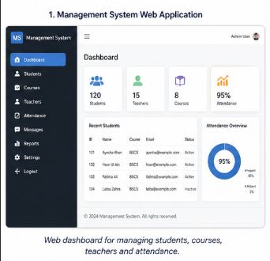
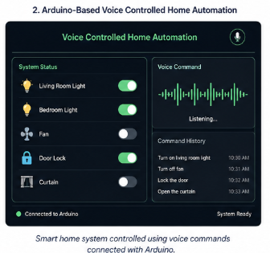
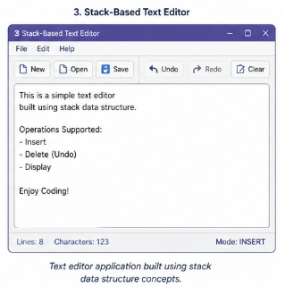
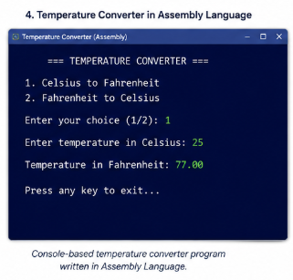
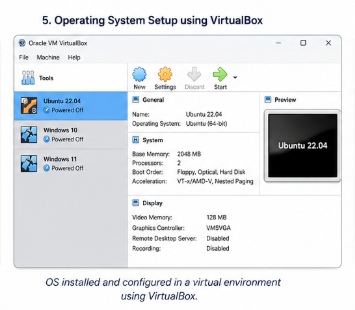
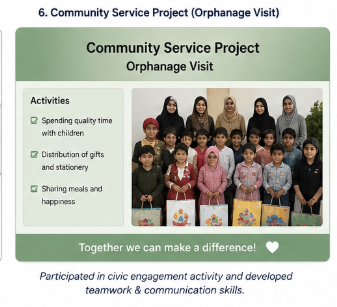

## 🚀 Featured Projects  

---

### 🔹 Management System Web Application  
📌 Web-based system for managing students, teachers, and attendance  
🛠️ Tech: HTML, CSS  

---

### 🔹 Voice Controlled Home Automation  
📌 Smart home system controlled using voice commands  
🛠️ Tech: Arduino  

---

### 🔹 Stack-Based Text Editor  
📌 Text editor built using stack data structure  
🛠️ Tech: C++  

---

### 🔹 Temperature Converter (Assembly)  
📌 Console-based temperature conversion program  
🛠️ Tech: Assembly Language  

---

### 🔹 Operating System Setup (VirtualBox)  
📌 Installed and configured OS in virtual environment  
🛠️ Tech: VirtualBox  

---

### 🔹 Community Service Project  
📌 Orphanage visit and social work activity  

